# Atividade Banco de Dados

Nessa atividade, irei fazer tudo que aprendi dos containers usando uma maquina virtual com a vesão do [Ubuntu Server](https://ubuntu.com/download/server) 22.04 LTS. Primeiro, a instalação será feita usando o programa [Oracle VM VirtualBox](https://www.virtualbox.org/wiki/Downloads), para instalar uma VM (Virtual Machine) com o Ubuntu Server, você precisará seguir os passos abaixo:

## Criando uma Maquina Virtual

Basta clicar em "Novo" e preencher o que pede, para colocar a imagem baixada do Ubuntu Server,coloque o caminho dela onde está escrito "Imagem ISO" e clique em Próximo.

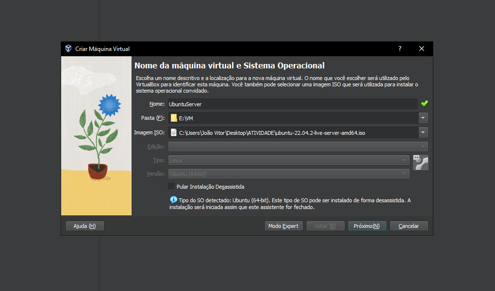

Em seguida, avance mais uma vez e na parte de hardware configure da forma que seu computador consiga funcionar sem travar.

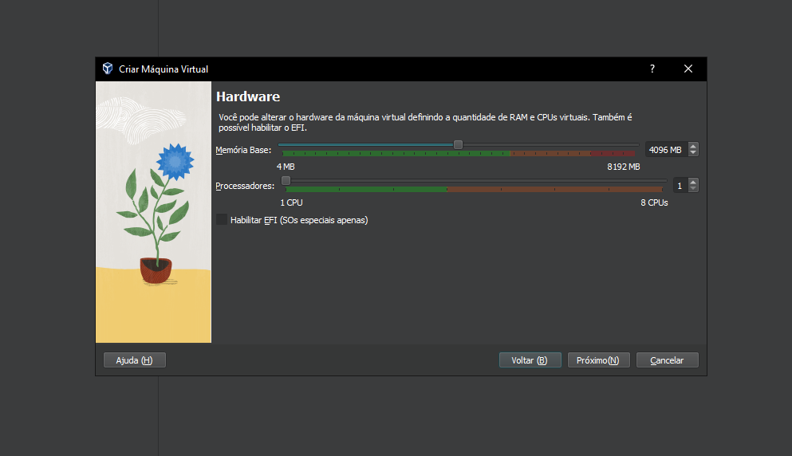

Na proxima tela, coloque o tamanho do disco que desejar(recomendo deixar padrão) e em seguida clique em Próximo, na ultima tela, apenas clique em Finalizar.

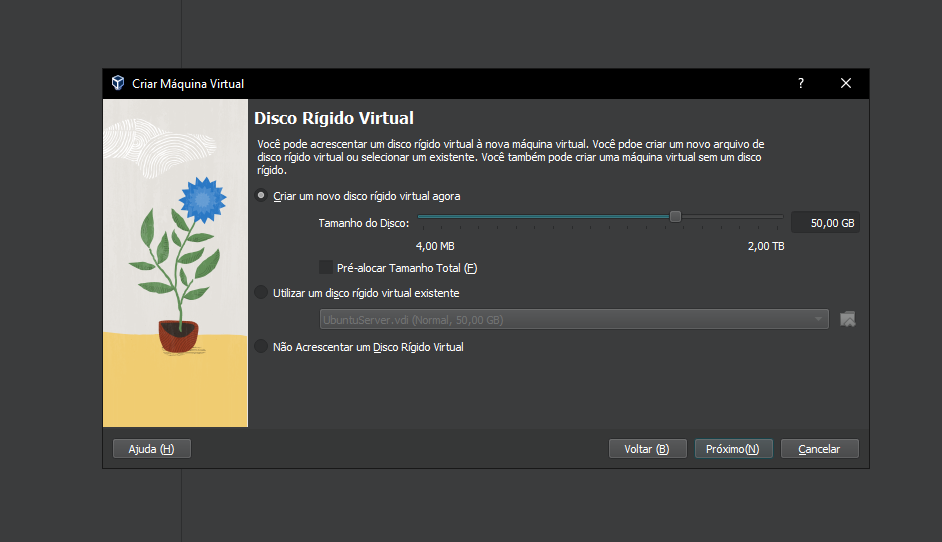

Antes de iniciar o sistema, é necessário configurar o redirecionamento de portas para facilitar mais pra frente. Para isso, basta clilar em Configurações->Rede->Avançado->Redirecionamento de Portas.

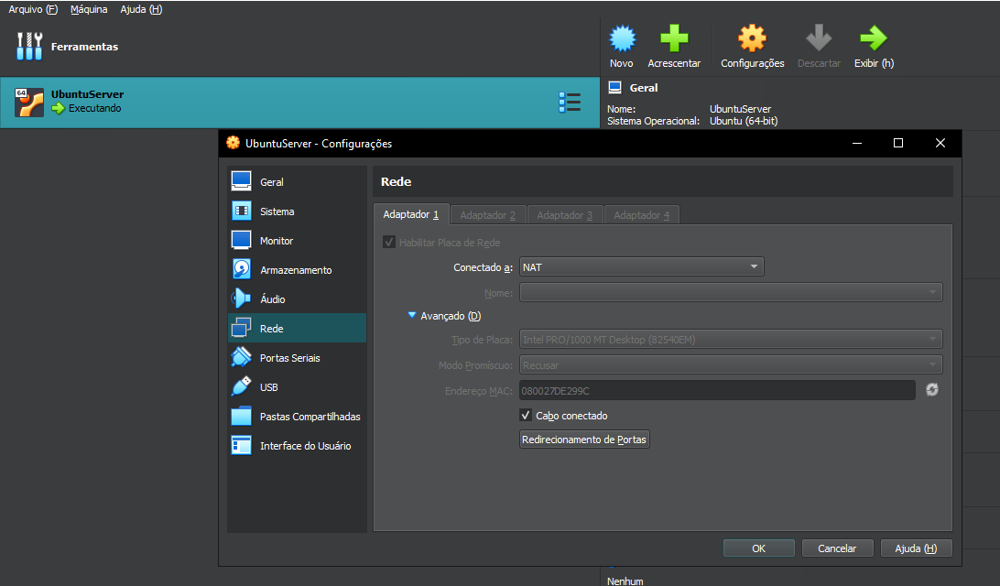

Com isso, Abrirá uma nova janela e nela você colocará quatro novas regras com os seguintes nomes: Ubuntu, MySQL, Adminer, Wordpress. Todos terão como o IP do Hospedeiro 127.0.0.1(localhost) e o ip de convidado 10.0.2.15(Ip da VM), porém nas Portas de Hospedeiro/Convidado serão diferentes para cada um. Veja na imagem Abaixo.

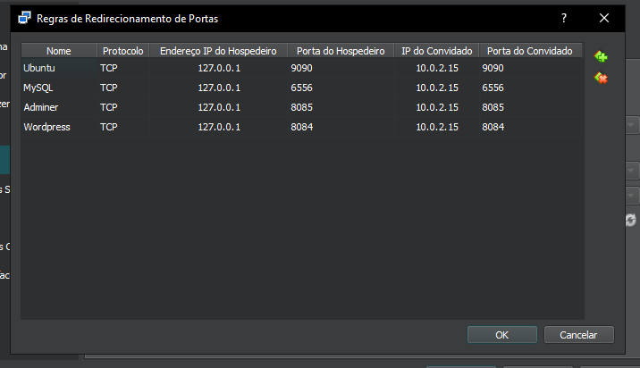

Depois de configurar essa para clique em OK e em seguida OK novamente. E com isso você acaba de configurar a sua maquina, agora é hora de configurar o Ubuntu Server.


#
## Configurando o Ubuntu Server

Agora que já temos uma VM com o Server instalado, basta iniciá-la. Na primeira tela do Server, escolha o idioma de sua preferência e avance.

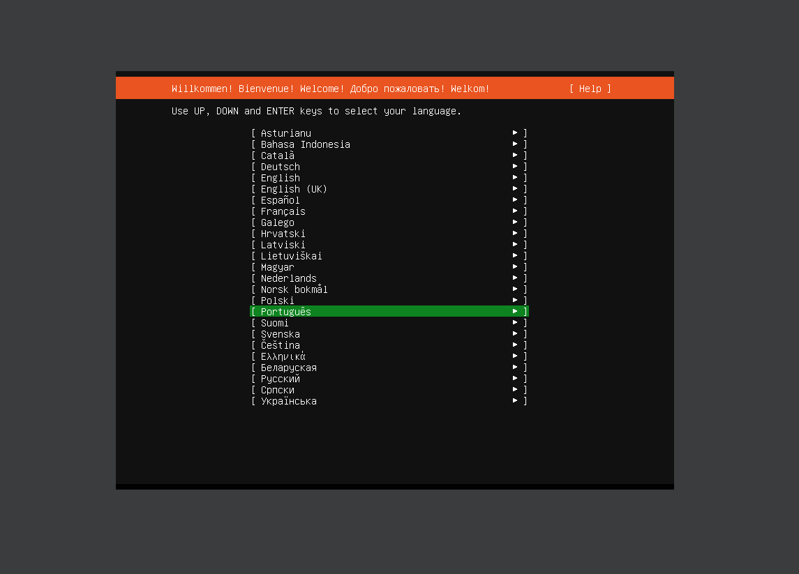

Agora, escolha o idioma do teclado com sua preferência também.

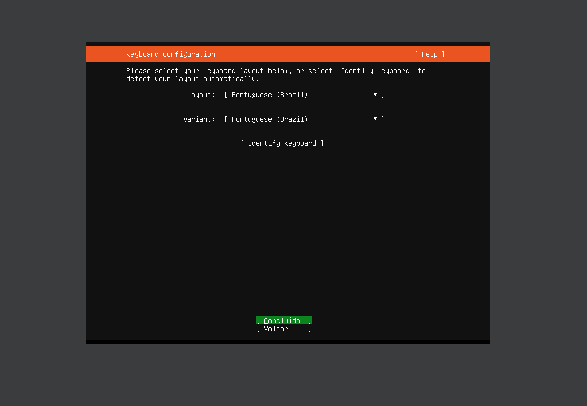

Avance até a parte de "Definição de Perfil", complete os campos vazios e continue avançando, até a instalação do sistema começar e aguarde.

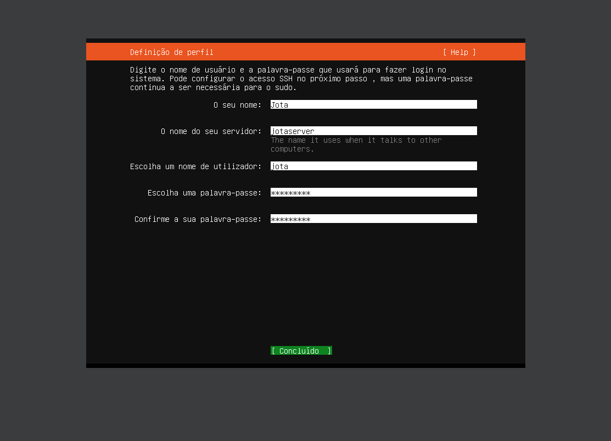

Depois da instalação basta clicar em "Reboot Now" e sua VM será reiniciada.

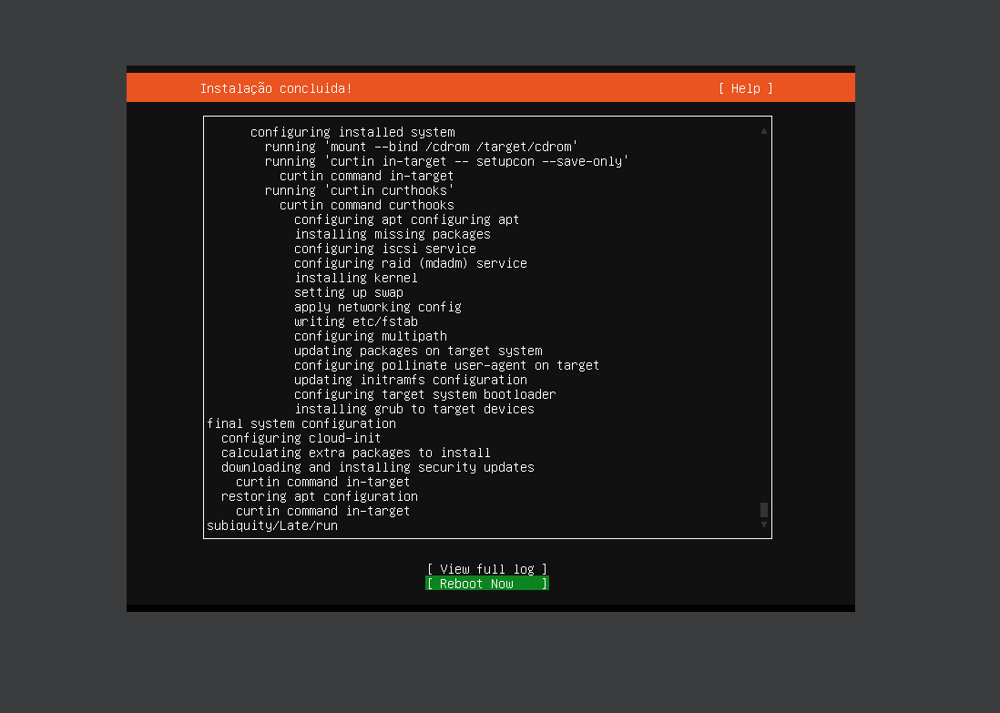

Quando terminar a reinicialização do sistema, o seu Ubuntu Server estará pronto para ser usado.

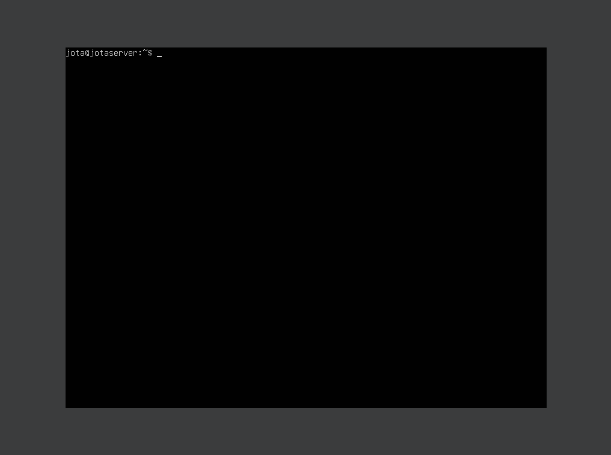

Com o Ubuntu Server pronto, será necessário instalar os programas agora, lembrando que por ser um terminal, tudo a partir daqui será por comandos.
#

## Instalando Programas no Ubuntu Server

No Ubuntu Server, usaremos alguns programas que não vem instalado no sistema como por exemplo o "Vim" para editar arquivos e o "net-tools" para ver o IP da Máquina. Vamos começar instalando o vim com o comando:

```
user@ubuntu:~$ sudo apt-get install vim
```

Depois que instalar o vim, instale também o net-tools com o comando:

```
user@ubuntu:~$ sudo apt-get install net-tools
```

### Com isso você já pode testá-los.

Para o vim, basta escrever **vim** no terminal que abrirá uma tela para mostrar que está funcionando
```
user@ubuntu:~$ vim
```

Já o net-tools, mande o comando no terminal:

```
user@ubuntu:~$ ifconfig
```
Com isso irá aparecer informações de rede na sua maquina.

---
## Agora Instalaremos o Cockpit

O Cockpit é uma interface de administração interativa, tem a vantagem de ser nuito leve e facil de usar, ela interage com o sistema operacional a partir de uma sessão real do Linux em um navegador.

Para instalar, basta colocar o comando:

```
user@ubuntu:~$ sudo apt-get install cockpit -y
```

Depois que terminar a instalação, inicie e ative o cockpit com o comando:

```
user@ubuntu:~$ sudo systemctl enable --now cockpit.socket
```

Agora que o Cockpit está firme e operante, precisará ter certeza que o usuário que você logar no Cockpit terá os privilegios do sudo (Super Usuário), para isso ponha o comando:

```
user@ubuntu:~$ sudo usermod -aG sudo USER
```

Em ***USER*** fica o nome do usuário da maquina. Ex: "user"@ubuntu:~$ .

Agora você já pode testar o Cockpit em seu navegador, é só abrir a barra de pesquisa e colocar *http://"seuipdohost":9090* . se por um acaso o navegador bloquear, procure algo como "avançado" na tela e continue mesmo assim, com isso você já está vendo a tela do Cockpit e para entrar basta colocar o seu usuário e senha do Ubuntu Server.

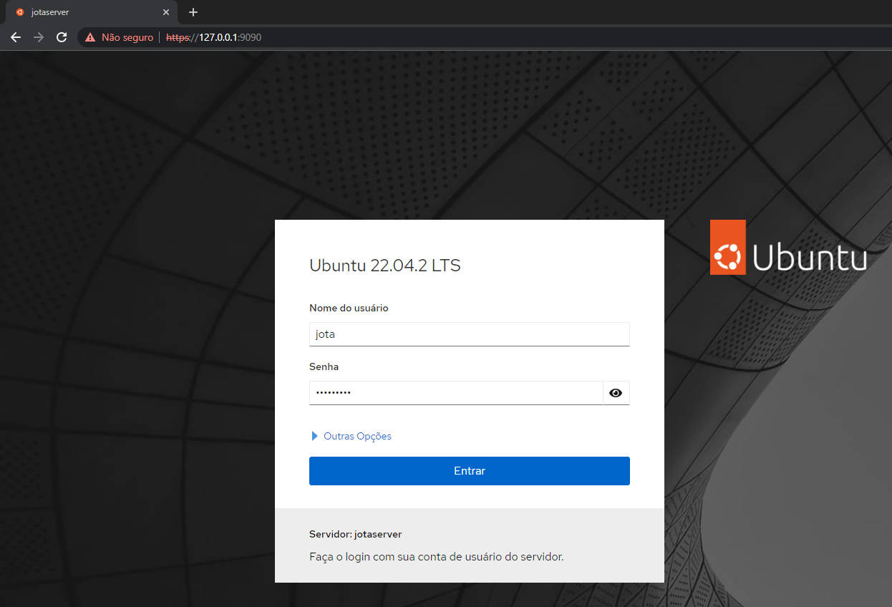

Assim que logar já será capaz de mexer no Ubuntu Server de uma forma facilitada, recomendo que ative o acesso administrativo clicando no botão azul da mensagem que apareceu.

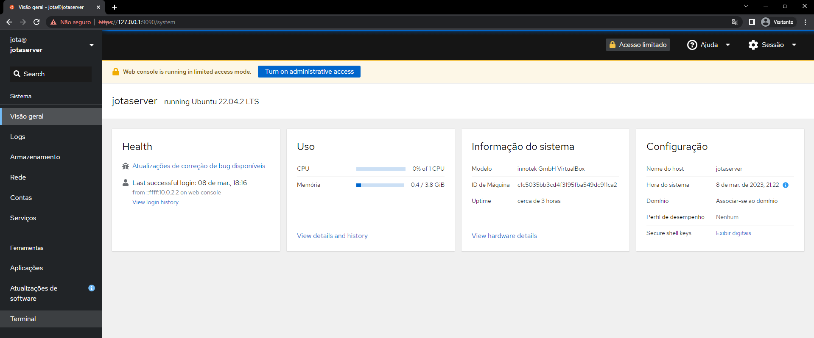

Agora coloque a mesma senha que usou para entrar no Cockpit

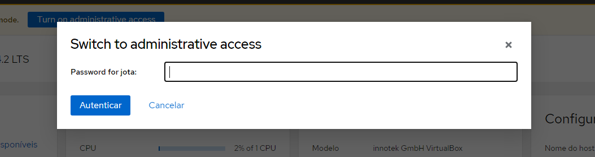

Pronto, seu Cockpit esta configurado, mais abaixo terá outra configuração utilizando o Cockpit e o Docker.

---

## Instalando o Docker

Agora iremos instalar o Docker no Ubuntu Server. O Docker é um aplicativo que simplifica o processo de gerenciamento de processos de aplicação em containers.

Iremos instalar o Docker do repositório oficial do Docker. Para fazer isso, adicionaremos uma nova fonte de pacote, adicionaremos a chave GPG do Docker para garantir que os downloads sejam válidos, e então instalaremos o pacote.

Primeiro, atualize o seus pacotes com o comando:

```
user@ubuntu:~$ sudo apt update
```

Em seguida, instale alguns pacotes pré-requisito que deixam o apt usar pacotes pelo HTTPS:

```
user@ubuntu:~$ sudo apt install apt-transport-https ca-certificates curl software-properties-common
```

Então, adicione a chave GPG para o repositório oficial do Docker no seu sistema:

```
user@ubuntu:~$ curl -fsSL https://download.docker.com/linux/ubuntu/gpg | sudo apt-key add -
```

Adicione o repositório do Docker às fontes do APT:

```
user@ubuntu:~$ sudo add-apt-repository "deb [arch=amd64] https://download.docker.com/linux/ubuntu focal stable"
```

Em seguida, atualize o banco de dados do pacote com os pacotes do Docker do recém adicionado repositório:

```
user@ubuntu:~$ sudo apt update
```

Certifique-se de que você está prestes a instalar do repositório do Docker ao invés do repositório padrão do Ubuntu:

```
user@ubuntu:~$ apt-cache policy docker-ce
```

Depois disso, instale o Docker com o comando:

```
user@ubuntu:~$ sudo apt install docker-ce
```

O Docker deve agora ser instalado, o daemon iniciado e o processo habilitado a iniciar no boot. Verifique se ele está funcionando:

```
user@ubuntu:~$ sudo systemctl status docker
```

O resultado deve ser similar ao mostrado a seguir, mostrando que o serviço está ativo e funcionando:

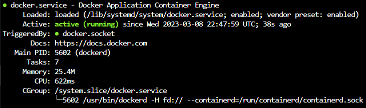

No terminal do Cockpit, escreva essse comando para adicionar o seu usuário no grupo do Docker:

```
user@ubuntu:~$ sudo usermod ${USER} -aG docker; sudo usermod USER -aG docker
```
Aqui também o ***USER*** fica o nome do usuário da maquina. *Ex: "user"@ubuntu:~$* .

Depois disso, No Cockpitm clique em *Sessão* e depois em *Log out*.

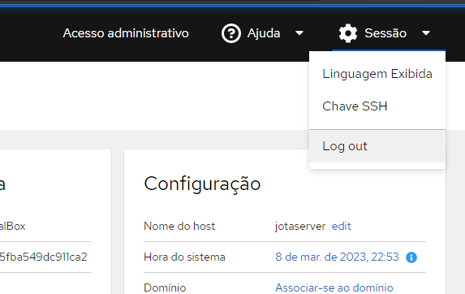

Entre novamente no Cockpit e está completa a instalação do Docker.

---

## Instalando o Docker Compose

O Docker Compose é uma ferramenta usada para definir e executar aplicativos de vários contêineres do Docker, ele será importante para a instalação do MySQL, o Adminer e o Wordpress.

Antes de Instalar o Docker Compose, é necessario criar dois diretórios que serão usados mais para frente e um arquivo que instalará os outros três, para isso usaremos o comando de criar diretórios:

```
user@ubuntu:~$ mkdir site-db
user@ubuntu:~$ mkdir site-wordpress
```
Usando o Vim, crie um arquivo com o nome docker-compose.yml usando o comando:

```
user@ubuntu:~$ vim docker-compose.yml
```

Dentro do arquivo criado, pressione a tecla I que irá habilitar a inserção. **PRESTE BASTANTE ATENÇÃO!!!** Tudo que for esrito tem que estar muito bem posicionado e não pode haver comentários dentro do arquivo, caso contrário, não irá funcionar. Veja o exemplo abaixo do arquivo "[docker-compose.yml](./docker-compose.yml)" (Linhas de Comentários estão marcadas com "#" no exemplo) :

```
# Primeiro, precisamos especificar a versão do docker-compose.

 version: '3.1'

# Agora vamos especificar os serviços que iremos usar.

 services:

# O primeiro que especificaremos é o banco de dados, irei chama-lo de db(database).

   db:

# Colocaremos o a imagem mais recente do MySQL.

     image: mysql:latest

# Adicionaremos também o "restart", "alwals" para caso aconteça alguma coisa com o
# container, ele irá reiniciar automaticamente.

     restart: always

# Precisaremos colocar a variavel de ambiente.

     environment:

# Colocaremos uma senha e um nome para o banco.

       MYSQL_ROOT_PASSWORD: senhadesuaescolha
       MYSQL_DATABASE: site

# Agora vamos mapear a porta que o container irá utilizar.

     ports:

# Ex.: porta do host "6556", porta do mysql "3306".

       - '6556:3306'

# Vamos especificar o volume também, no "site-db" espelhará o caminho
# mostrado "/var/lib/mysql".

     volumes:
       - ~/site-db:/var/lib/mysql

# Precisamos também expor a porta do mysql.

     expose:
       - '3306'

# Agora vamos adicionar o Wordpress, as 3 primeiras linhas é basicamente o
# mesmo procedimento do anterior somente precisando mudar o nome do serviço e
# o nome da imagem(no wordpress não é necessário especificar a versão).

   wordpress:
     image: wordpress
     restart: always

# nessa parte, vamos adicionar a variável de ambiente do Wordpress.

     environment:

# Primeiro, irei adicionar o host que é o banco de dados (db), depois vamos dar
# um nome para o usuário do wordpress(root), em seguida a senha de acesso 
# (senhadesuaescolha), agora o nome que colocamos para o mysql(site) e por fim
# vamos mudar o prefixo do wordpress para "ps".

       WORDPRESS_DB_HOST: db
       WORDPRESS_DB_USER: root
       WORDPRESS_DB_PASSWORD: senhadesuaescolha
       WORDPRESS_DB_NAME: site
       WORDPRESS_TABLE_PREFIX: ps

# Vamos definir a porta também. Ex. : "8084" é a porta do host e "80" é a porta
# do wordpress. Também irei expor a porta "80".

     ports:
       - '8084:80'
     expose:
       - '80'

# O volume também será adicionado para o Wordpress.

     volumes:
       - ~/site-wordpress:/var/www/html

# Por último iremos colocar o Adminer, lembrando que não precisa necessáriamente
# seguir esta ordem. Também não será necessário especificar a vesão da imagem.

   adminer:
     image: adminer
     restart: always

# Especifique a porta do Adminer aqui também, mas não precisa expor a porta do tal.

     ports:
       - '8085:8080'
```
Quando terminar de editar o arquivo, volte apertando a tecla "*ESC*" e depois na tecla " *:* " (tem que ser literalmente o "dois pontos") , e escreva "*wq*" para salvar e sair do arquivo.

O arquivo e as pastas já estão prontos agora só falta instalar o Docker Compose, agora só precisa por o comando:

```
user@ubuntu:~$ sudo apt-get install docker-compose
```

Com o Docker Compose instalado e o resto configurado, já podemos iniciá-lo usando o comando:

```
user@ubuntu:~$ docker-compose up
```

Essa parte irá demorar um pouco, quando o terminal trava, significa que está em operação e pronto para usar os programas instalados. Para cancelar a execução do Docker Compose, basta dar "Ctrl + C".

---
## Testanto o MySQL

O MySQL é um sistema de gerenciamento de banco de dados, que utiliza a linguagem SQL como interface. Para esse teste será necessário um programa de banco de dados instalado na maquina original, no meu caso, estou usando a ferramenta MySQL Workbench.

Com o Workbench aberto na tela inicial, clique no "+" e mude a porta 3306 para 6556 e teste a conecção, ele irá pedir a senha e então coloque a senha que você colocou no arquivo [docker-compose.yml](./docker-compose.yml), se der certo irá aparecer uma tela similar com a da imagem abaixo.

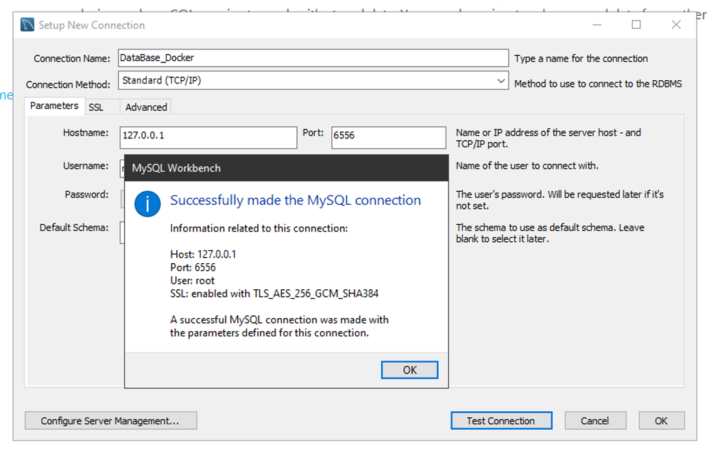

Com isso, o teste está bem sucedido e pronto para configurar o banco de dados.

---

## Testanto o Adminer

Adminer é uma ferramenta para gerenciamento de conteúdo em bancos de dados. no meu caso ele está gerenciando o MySQL. Para vermos a tela do Adminer teremos que abrir o navegador e na barra de pesquisa colocar *http://"seuipdohost":8085* . Veja a imagem abaixo:

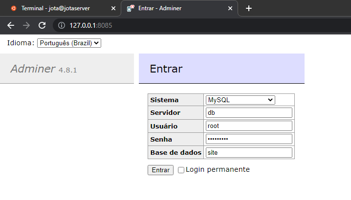

Nessa parte, você precisa preecher os espaços com o que você comfigurou no seu arquivo [docker-compose.yml](./docker-compose.yml), depois de prencher clique em Entrar.

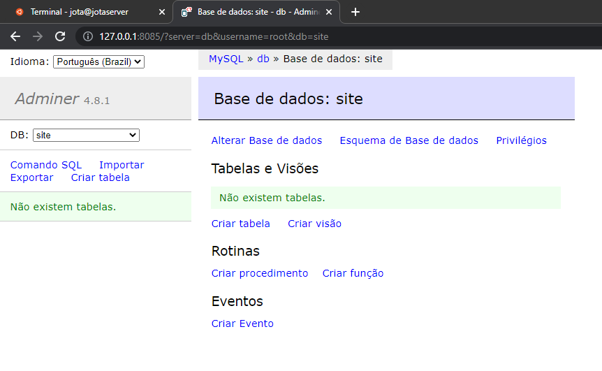

E aqui está o painel do adminer, por enquanto ainda não tem nada mas pode mudar no futuro.

---

## Testando o Wordpress

WordPress é um sistema livre e aberto de gestão de conteúdo para internet, baseado em PHP com banco de dados MySQL

O procedimento é o mesmo feito acima com o Adminer, no seu navegador, clique na barra de pesquisa e coloque *http://"seuipdohost":8084* , agora escolha o idioma de sua preferência e prossiga.

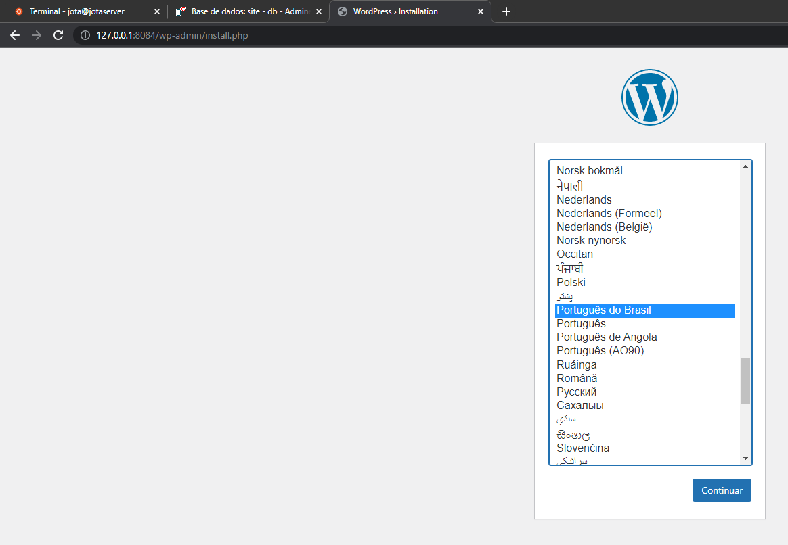

Na proxima pagina, preencha os campos do jeito que achar melhor (obs: não é necessário um email real). Veja o exemplo abaixo:

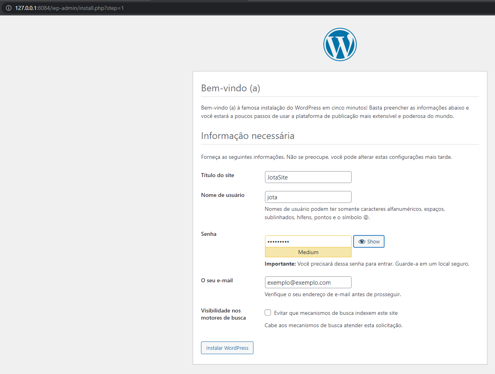

Depois de instalar o Wordpress, acesse usando o login que acabou de criar.

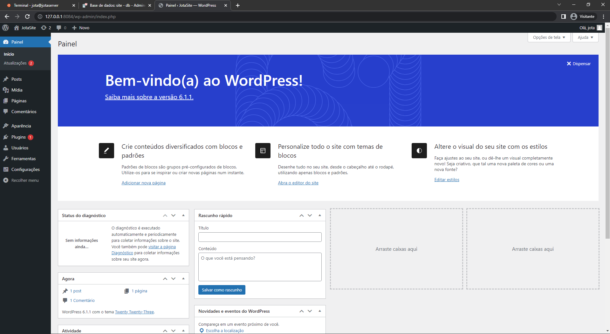

E Aqui está o seu Wordpress pronto para ser usado.

---